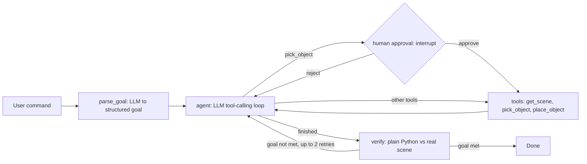

# Safe LLM Robot Agent: LangGraph + PyBullet

A natural-language agent that controls a simulated Franka Panda arm, verifies its own results
against the real scene, and recovers from failures. Built with LangGraph, LangChain and Groq.

**Demo:** [add video or GIF link here]

## What it does
Type "put the red cube in the blue zone", then a follow-up like "now put the green cube in the gray zone".
The agent acts only through validated tools, a human can approve or reject each pick, and an
independent verifier checks the real scene before the task counts as done.

## Architecture


## Design choices
- The LLM never emits motor commands. It can only call three validated tools.
- Three layers of defense: (1) tool postconditions (`place_object` re-checks the real scene),
  (2) the agent's own final check, (3) an independent verifier whose pass/fail is plain Python, not an LLM.
- LangGraph features used: stateful graph, conditional routing, checkpointer memory (follow-up commands),
  human-in-the-loop `interrupt`, and a verification retry loop.
- Failure injection (`!drop`): the cube slips during placement while the tool still reports success,
  to test detection and recovery.

## Evaluation (11 hand-written cases, 2 independent runs)
| Metric | Run 1 | Run 2 |
|---|---|---|
| Overall task success | 11/11 | 11/11 |
| Recovery from injected failures | 4/4 | 4/4 |
| Correct refusals (impossible tasks) | 2/2 | 2/2 |
| Runs rescued by the independent verifier | 1 | 1 |
| Avg tool calls per task | 5.2 | 5.1 |
| Avg time per task | 22.9 s | 17.1 s |

Per-case results of the latest run: `eval_results.json`.

## Limitations
- Small evaluation: 11 cases, two runs. LLM behavior varies between runs.
- Grasping uses a fixed constraint instead of friction physics. One cube per zone.
- Only one fault type is injected (dropped cube).
- The verifier-rescue case uses a deliberately lying tool (self-checks switched off), so it
  demonstrates the safety layer by design, not a naturally occurring failure.
- The two refusal cases pass partly because the goal parser falls back to "no checkable goal"
  when its structured-output call fails.
- The agent reads ground-truth scene state; there is no vision.

## Run it
```bash
pip install -r requirements.txt        # PyBullet may need: conda install -c conda-forge pybullet
copy .env.example .env                 # then add your Groq API key (Mac/Linux: cp)
python agentv2.py                     # interactive agent
python eval.py                         # headless evaluation
```
Interactive commands: a task in plain English, `!drop` (inject a failure), `!reset`,
`!approve on/off`, `!toolcheck on/off`, `quit`.

## Files
- `robot_sim.py`: PyBullet arm, cubes, zones and robot tools
- `agentv2.py`: the LangGraph agent
- `agent.py`: earlier one-shot plan-and-execute baseline
- `eval.py`: automated evaluation

## Future work
Vision-based perception (replacing ground-truth scene state), harder tasks such as stacking and sorting,
comparison across LLMs, and a ROS2 bridge to a real arm.
